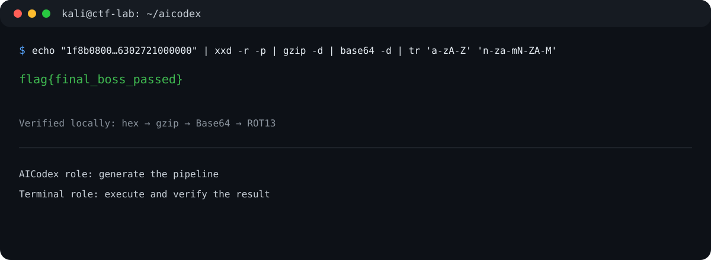

# AICodex — Local CTF & Cybersecurity Assistant

A practical Ollama setup for a local, offline-first cybersecurity assistant built around **Qwen2.5-Coder 14B**.

It is designed for authorized CTFs, homelabs, defensive security work, PowerShell/Bash command generation, log analysis, and learning workflows. It is not an autonomous exploitation tool: have it produce a command, run it in your own lab or CTF environment, then verify the result.

> **Performance:** For the best speed and full use of your CPU, memory, and any supported GPU acceleration, run Ollama and AICodex directly on your host operating system—not inside a virtual machine. A Kali VM is still useful as a separate terminal for authorized CTF commands.

> **Responsible use:** This repository is for lawful, educational, and authorized use only. See [RESPONSIBLE_USE.md](RESPONSIBLE_USE.md) and [LICENSE](LICENSE).



## Clone and run the same setup

Install [Ollama](https://ollama.com/download) first, then choose the shell you use. These commands download the base model, build the custom `aicodex` model from this repository’s `Modelfile`, and start it.

### Windows PowerShell

```powershell
git clone https://github.com/viktor-h-tech/aicodex-local-ctf.git
cd aicodex-local-ctf
.\scripts\setup-aicodex.ps1 -Run
```

If PowerShell blocks the local script, allow it for only this terminal session and run it again:

```powershell
Set-ExecutionPolicy -Scope Process -ExecutionPolicy Bypass
.\scripts\setup-aicodex.ps1 -Run
```

### Kali Linux, Debian, or WSL

```bash
git clone https://github.com/viktor-h-tech/aicodex-local-ctf.git
cd aicodex-local-ctf
bash scripts/setup-aicodex.sh --install-ollama --run
```

The first run uses Ollama’s official Linux installer only when Ollama is not already installed. It then pulls the model, creates `aicodex`, and opens the chat.

After setup, the model is available any time with:

```text
ollama run aicodex
```

## Manual Ollama CLI

If Ollama is already installed and you prefer to see each step, run these commands from the cloned repository folder:

```bash
ollama pull qwen2.5-coder:14b
ollama create aicodex -f ./Modelfile
ollama run aicodex
```

The same three commands work in Windows PowerShell; use `.\\Modelfile` instead of `./Modelfile` if preferred.

## Example prompts

New to local AI or introducing AICodex to a classmate? See [example prompts](docs/EXAMPLE_PROMPTS.md) for copy-paste starting points for exact decoding, layered artifacts, PowerShell 5.1, safe file triage, web-request analysis, defensive logs, and command explanations.

**Best rule for flags and transformations:** ask AICodex for a command that calculates and prints the answer, run it in your own terminal, then paste the real output back. Do not trust a model to mentally guess a multi-step final flag.

## Why use a heavier 14B model on modest hardware?

The ThinkPad used for this project has an Intel Core 7 240H, 32 GB DDR5 memory, and Intel integrated graphics. That means local inference is constrained mostly by CPU and shared memory—not dedicated GPU VRAM.

We still chose `qwen2.5-coder:14b` because the smaller models were fast but unreliable in the exact workflows that matter for CTF learning:

| Model | Download size | Observed role | Decision |
| --- | ---: | --- | --- |
| [`qwen3:1.7b`](https://ollama.com/library/qwen3) | ~1.4 GB | Quick chat and lightweight help | Too weak for dependable multi-step CTF work |
| [`qwen3:4b`](https://ollama.com/library/qwen3) | ~2.5 GB | Better general assistant | Can become slow or verbose when reasoning |
| [`qwen2.5-coder:3b`](https://ollama.com/library/qwen2.5-coder) | ~1.9 GB | Fast code snippets | Missed simple decode/format tasks |
| [`qwen2.5-coder:14b`](https://ollama.com/library/qwen2.5-coder) | ~9.0 GB | Kali/Bash and PowerShell command generation | **Chosen** |

The goal is not to make the laptop compete with a desktop GPU. The goal is to accept slower generation in exchange for substantially better command construction, instruction-following, and troubleshooting. For exact transformations, use the command it provides and verify output locally.

## Safe, effective workflow

1. Tell AICodex the task is an authorized CTF, lab, or owned system.
2. Ask it for a copyable command in the correct shell.
3. Run that command in a separate PowerShell, Kali, WSL, or lab terminal.
4. Feed the actual output back to AICodex for the next step.

This keeps the model useful without trusting it to silently calculate every flag or execute anything on your host.

## Example: layered CTF artifact

Given a payload that is hex → gzip → Base64 → ROT13, AICodex produced this valid Kali pipeline:

```bash
echo "1f8b08000000000000034b36ce294df128a94ac9752b4d0db32c8bcc8dca8d30f22b8dca8daa4c8e30b0e5020008b6302721000000" | xxd -r -p | gzip -d | base64 -d | tr 'a-zA-Z' 'n-za-mN-ZA-M'
```

Output:

```text
flag{final_boss_passed}
```

## Repository layout

```text
.
├── Modelfile                 # Custom AICodex behavior on Qwen2.5-Coder 14B
├── docs/
│   ├── SETUP.md
│   ├── TROUBLESHOOTING.md
│   └── VALIDATION.md
├── scripts/
│   ├── setup-aicodex.ps1     # Builds AICodex on Windows PowerShell
│   ├── setup-aicodex.sh      # Builds AICodex on Kali/Debian/WSL
│   ├── decode_layers.sh
│   └── decode_layers.ps1
└── assets/                   # Terminal-style screenshots for the README
```

## Limits

- A Modelfile changes behavior and response style; it does not train or upgrade the base model.
- A local Ollama chat does not execute commands. Use a separate terminal or an approved agent workflow in a disposable CTF workspace.
- The 14B model can still make mistakes. Treat generated commands as suggestions and validate them before use.

## License and permitted use

This repository is available **only for lawful, educational, and non-commercial use**—such as personal learning, coursework, authorized CTFs, homelabs, and non-commercial research.

Commercial use, resale, paid hosting, and incorporation into commercial products or services are not permitted. The author is not affiliated with, responsible for, or liable for unlawful or unauthorized use by any individual or organization. The repository is provided without warranty, to the maximum extent permitted by law.

This is a custom source-available license, not an OSI-approved open-source license. See [LICENSE](LICENSE) for the complete terms.
